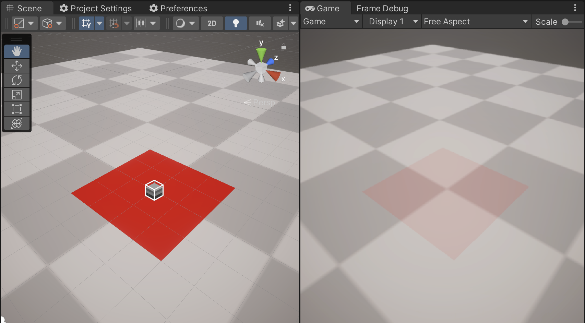

# URP DepthPriming x MSAA Depth bug Repro.

This repository contains repro project for rendering bug in Unity.

There is a shader in this project that projects a decal on top of surface using depth buffer projection technique.

In scene view camera is rendering without MSAA and decal is rendered without any glitches.
In game view camera is rendering with both MSAA and depth priming enabled at the same time. This combination is causing rendering glitches.

Example:

This bug reproduces in Unity 2021.3.14f1, 2022.2.17f1, 2022.2.21f1, 2023.1.0b15. Other versions were not tested.
Setup:
- Windows 10 22H2 on Core i7-7700HQ or macOS Ventura 13.0.1 on M1 Pro
- Rendering api Metal, DirectX11, Vulkan
- URP 12.1.8, 14.0.7, 15.0.5
- Universal Renderer Data: DepthPriming ON
- URP Asset: MSAA: x4

To reproduce the bug one should follow the steps described below.
1. Open this Unity project.
2. Open scene SampleScene.
3. Enter Play Mode.

Expected behavior: decal (red square) is always opaque, without any glitches.
Actual behavior: decal is semi transparent and/or with glitches when rendered under certain camera angles.
